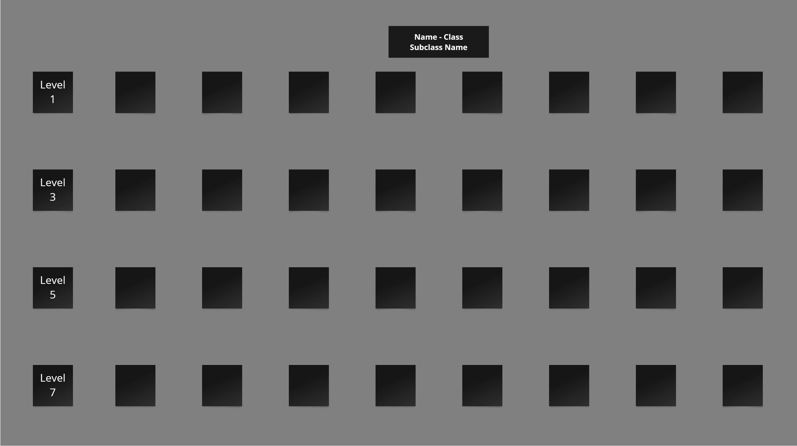

### **Lore:**

Every character (Pawn) has a general story. They also have:

Visual Novel dialogue: Potential storytelling dialogue

General dialogue: Dialogue popup boxes that happen every so often

<br>

### **General roles:**

Do note that this game does not have very DnD focused roles, since many characters are hybrids and flexible in many ways.

Tank - The defensive health heavy, crowd control character that wants to protect the team.

Bruiser - The offensive survivable character that wants to fight in close quarters and sustain.

Assassin - The glass cannon character in the front who focuses on combos and mobility.

Ranger - The glass cannon character in the middle who focuses on single target damage.

Mage - The glass cannon character in the back who focuses on area of effect damage.

Support - The defensive character that focuses on utility, healing, and saving teammates.

### **Sample Skill Tree:**



### **Skill Trees:**

Split into X branches, each branch focuses on a specific playstyle. Can be similar to XCOM, Partisans 1941, or HotS skill trees, with each branch having X unlockable talents, and each talent having a level prerequisite. Keep it simple- each talent has a 1 skill point prerequisite + a level prerequisite + talent taken requirement (specific talents). No max level, grants 2 skill points per level. The talents are split at level 1, level 3, level 5, and level 7, with no maximum level.

This is one sample skill tree for a character. It is very similar to Partisans 1941’s skill tree. Miro is a tool that we use to build skill trees. See the front page for an embedded miro. [Miro](https://miro.com/)

<br>

Creating range jpg files are really easy with google drawings. These allow me to generate easy drawings of ranges. The total set of drawings per range will be placed in a separate section of the design doc. [Google Drawings](https://docs.google.com/drawings/create)

<br>

### Each character class has the following stats:
<div class="grid" markdown>

```
200 HP
10 MP
5 AP

Basic Attack:
1 AP Cost
10 Damage
```

{ width="350",align=right }
</div>

The above shows that the character has 10 MP and 5 AP. It also shows that the Basic Attack from player (gray square) can attack a single unit (red square) in a single tile up to 5 tiles away. These are some baseline stats that generally would fit a normal character.

<br>

### Each ability has a similar breakdown as well:
<div class="grid" markdown>

```
Ability 1 - Active
1 AP Cost
10 Damage
Unlocks: Ability 2

Description
```

{ width="350",align=right }
</div>

The above shows that the Ability is an AoE, hitting all enemy units 5 tiles away. These are some baseline stats that generally would fit a normal active ability.

<br>

### Each character has a similar passive breakdown as well:
```
Passive 1 - Passive
Unlocked By: Ability 1

Description
```
The above shows that there is a Passive on the character.

Every character has an innate passive or active that is always on every character for free.

Many abilities and passives have prerequisites, either a single one, or one of many, picking between multiple abilities or passives.

<br>