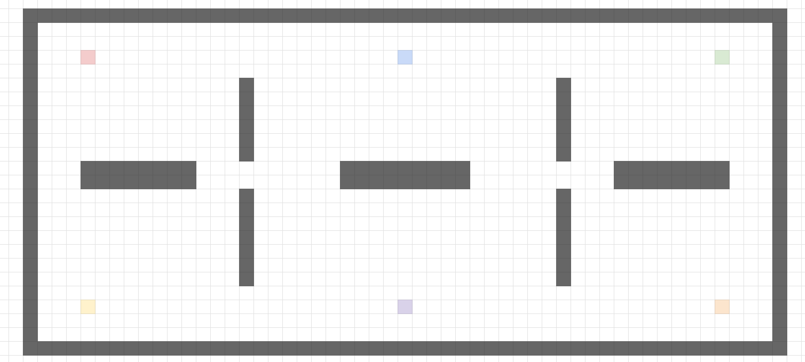
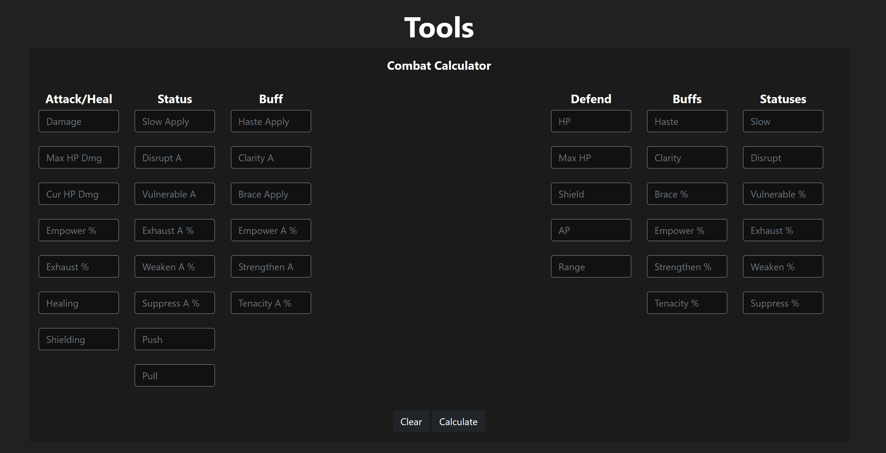
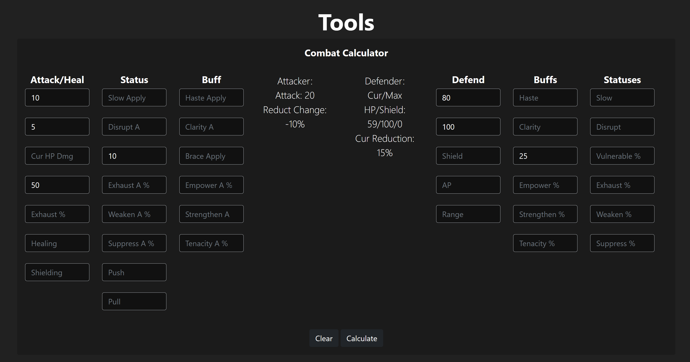

This is an xcom style game, which when the game actually releases, it can be entirely played on a Unity platform. However, pen and paper can be played on something similar to Google Sheets, or any other tile based platform.

### Here are the general steps to play on pen and paper (self hosted):

- Gather X friends (at least 1 other friend) for a short-form live game or a long-form game that lasts as long as you want it to, with turn durations as long as you can make the turn.
- Pick the ruleset: what number of characters, who is on who’s team, and what kind of scenario the game state is in. There can be any number of characters, any number of teams, and any situation set, but keep in mind the more characters and teams there are, the longer the game will take.
- Pick the characters, skill tree, and set of abilities. Adjust the levels, number tuning if you want more/less HP/AP, and anything else you’d like to set, like banning specific characters or anything.
- Once everyone has set their characters and/or added custom characters and enemies, pick a map with an objective. For example, refer to the bottom spreadsheet. Add tiles, spawn points, objectives, and everything else needed to build the map. Set walls, spawn points, and anything else needed.
- [PoD Test Board](https://docs.google.com/spreadsheets/d/1TnRWQO8AqMCKTs4coh4KjBzdS4kbZ0crADjyUWOCoJg/edit?usp=sharing)
- One sample of a map could be this, with gray as walls, and colored squares as spawn points. This map assumes that there are 6 players, and each player can have up to 6 characters as a free for all.

- Once characters are set, teams are set, objective is set, and map is set, the game can be played from there.
- In order to show information of each unit, set a tile with some representation of the unit, and then write a note (right click → add note) on the unit. Notable information is usually HP, AP, and effects, along with cooldowns.
- Also write a note (right click → add note) on tiles with special effects.
- Do actions by editing the notes when the action is done, along with cutting and pasting tiles to change where the unit is.

### One sample run would be the following:

- 1 friend and myself decide to play. We state that it is a 1v1, full team deathmatch.
- The friend picks char 1, I pick char 2. I pick the ranger skill tree, they pick the mage skill tree. We set the level to level 3, so we could pick either 4 level 1 abilities and 2 level 3 abilities, or 6 level 1 abilities, or even 5 level 1 abilities and 1 level 3 ability.
- We pick two different spawns, I pick blue, they pick purple spawn of the above map.
- I go first, they go second. I move to his side of the map and shoot him once.
- He shoots me back, and does a number of abilities up to his AP limit.
- I shoot him back, and do a number of abilities up to my AP limit.
- Rinse and repeat till the game is done.

 

Calculations can be easily solved with this combat calculator:

[Combat Calculator](https://luxsdg.github.io/Pawns%20of%20Despair/podUtility.html)

This is a guide to showcase a general playthrough with this.

 

### This is the image of the calculator by default.

- You can see the attacking (left) side and the defending (right) side.
- Input values of the stats on the attacker, including damage (or healing/shielding), max HP damage (%), current HP damage (%), for the attacker, along with buffs and debuffs to the attacker, and any buffs and debuffs to apply.
- Input values of the stats on the defender, including HP, max HP, and current buffs and debuffs to calculate with the attack.
- You can calculate how much damage would be done based on the current buffs and debuffs the attacker and defender have.

 

### One example is below:

- Here we see an attack for 10 damage and 5% max HP damage. The attacker is also buffed by 50% empowered, and applies 10% vulnerability.
- The defender has 80/100 HP, and is 25% braced.
- The calculation is as follows: the attack is 10 damage + 5 damage, which adds half of each attack due to the 50% empower to 22 damage (10 + 10 * 0.5) and (5 + 5 * 0.5) respectively
- However, the damage reduction is 15% total for the target, as 25 - 10 = 15%. This calculates to 20 damage overall, leading to 60/100 HP remaining (minus some rounding issues).

 
